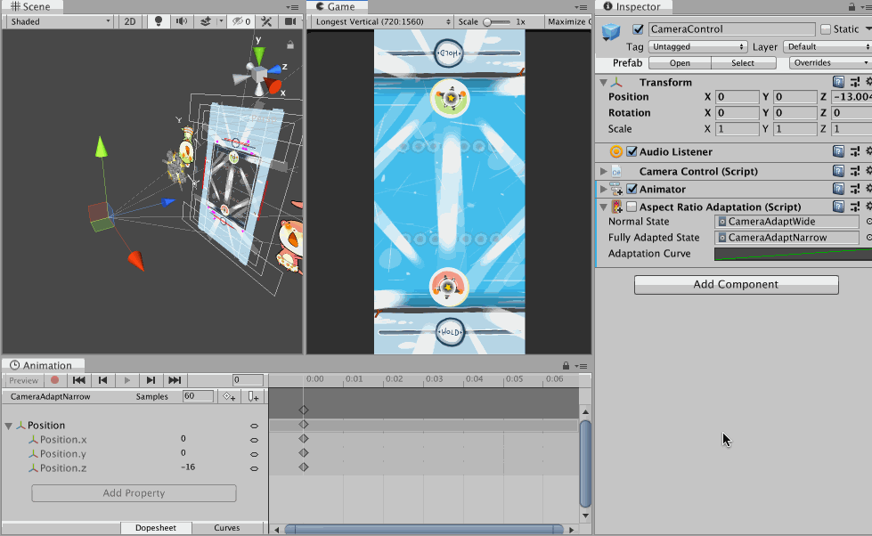
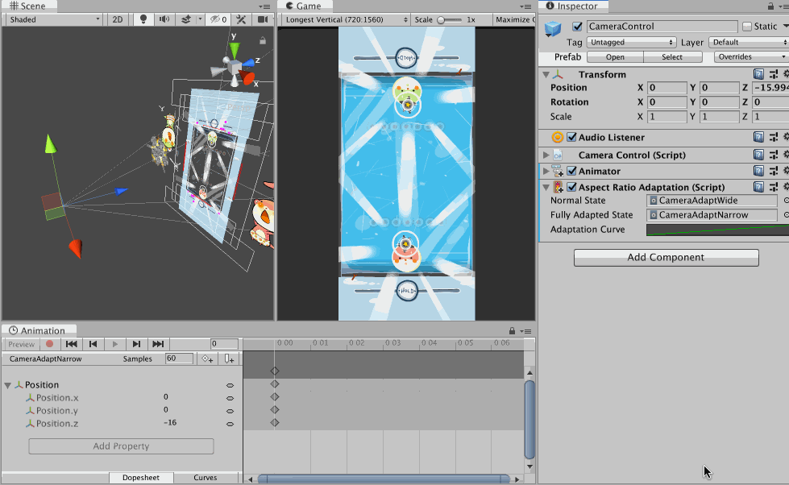

[Back to the summary](../Components.md)

# Adaptation Components

For non-uGUI objects, sometimes there are controls waiting to be raycasted by something like `Physics2DRaycaster` to trigger the `EventSystem` just like UI objects. Notch could make those objects difficult to touch, but this time we have no help from uGUI layout system to move things out of the way.

How "adaptation" components works is that it could move things out of the way with help from Animation Playables API, which uses `Animator` component without a controller asset to bind to desired properties. (In fact, the controller asset should internally ended up using Animation Playables API.)

My design is that we will have 2 **single-frame** `AnimationClip` that represent "normal state" and "fully adapted state". These clips could control just about anything keyable, and the evaluated value could be blended anywhere between 2 clips.

Default to all adaptation components, it adapts once automatically only on `Start()` since unlike uGUI's layout system where all the edges and sizes cause ripple effect, it is not expected that the value controlling the adaptation will change often. (Aspect ratio couldn't change mid-game, notch couldn't expand mid-game, etc.) You could still adapt again normally with manual `Adapt()` call.

It also has one `AnimationCurve` mapper called the "adaptation curve". It should evaluates to 0 to 1, where 0 means you get a normal state clip, and 1 means you get fully-adapted clip. Now about the input to this curve, it depends on what kind of adaptation component will provide what value.

##  AspectRatioAdaptation

An adaptation where the time value for the adaptation curve came from screen aspect ratio number. The number is always assumed to be width/height regardless of game's orientation, so for example, it is always 1.3333 (4/3) for iPad. You could use this to **indirectly** fix notch problem, without knowing if the notch exists or not. (Things respond to aspect ratio and not the notch.)

This gif demonstrate the problem of non uGUI objects when the aspect ratio changes. The camera shrink horizontally on narrower device when on portrait orientation. Before, I prepared a stage so that on iPad there are non-gameplay extra spaces around and could be cropped safely.

(It is not even safe anymore nowadays since I assumed the narrowest was 16:9 in the past, now it goes beyond 2:1 and clips even more edge out of the stage.)

However this assumption is no longer safe with an arrival of notch trend, since narrower device *horizontally* could possibly have lesser *vertical* space. It could make the control at top and bottom edges difficult to use.

With `AspectRatioAdaptation`, I could dynamically change *anything* according to aspect ratio number. Notice that nothing on the scene moves with notch on or off, because it adapts to aspect ratio and **indirectly** fix notch problem.

In this example, in addition to the camera narrowing normally by Unity, I want it move a bit backwards with `AspectRatioAdaptation` when it gets narrower. Because of perspective settings, moving a camera backwards will scale everything down, make room on the top and bottom, and in turn create a space for notch. We have avoided the notch without querying for an existence of notch this way.

Additionally, you see that the stage itself expands vertically a bit too as a finishing touch. This affects gameplay a bit but overall looks nicer on narrow device than using the same stage shape as iPad aspect ratio.

The 2 clips on the camera in this example are each just a single frame keyed as `z = 13` for normal state and `z = 16` for fully-adapted state. The `adaptationCurve` is set so that time 1.3333 evaluates to 0, and time 2.1667 evaluates to 1. And 1.3333 is an iPad's aspect ratio, so it get fully normal state clip. If you use iPhone SE which has 16:9 ratio (1.7778), you would get somewhere between these 2 clips. (2.1667 is calculated from LG G7's ratio, I think it is the narrowest/longest phone right now.) You can see at the corner that `z` is really -13 when the game view is on iPad aspect.

##  SafeAreaAdaptation

This is like `AspectRatioAdaptation` but this time, the time value to evaluate the Playable graph is a **relative screen space taken** by a **single side** of safe area.

In this image, I show that both adaptation components could be used together to drive different things on the same object hierarchy, with a single `Animator` for Animation Playables API.

- `AspectRatioAdaptation` is first used to move the camera up in the case of narrow screen, so I get similar horizontal range but expose more vertical range due to perspective setup. That makes the picnic mat which was planned to be at the bottom edge of camera frustrum exposed.
- So an another `AspectRatioAdaptation` is used on the mat to move its Z position back to maintain the look of a mat sticking out from the edge of the screen.
- However we have one more problem that is if the notch is present in this adapted narrow phone state, the mat on the top side got occluded out too much.
- So I could add one more fix with `SafeAreaAdaptation`, this time driving a bit of Z *scale* of the mat.
- Because you must select a single side, I choose `Top` for both adaptation of top and bottom mat because some Android phone doesn't have bottom safe area data padded in like an iPhone. Or you could choose `Bottom` with `SafeBalanced` and it will check out the opposite side and use it if the padding is larger.

The default adaptation curve is `0, 0` to `0.0542, 1`. This `0.0542` is relative screen space taken by the top notch of an iPhone X. I believe it is the largest notch out there so I think it is a good default. That means when you play with Android phones with a cutout you will likely get less than fully adapted state. Anyways, you should be debugging in editor on iPhone X overlay when using this feature.

## Editing the adaptation

Playables API requires an `Animator` component, however the controller asset is not needed so just add an empty `Animator` and fold it away. (It must be `.enable = true` though.)

Unfortunately without the controller asset **connected** to `Animator` component, you cannot use the Animation tab to design the 2 adaptation clips. As a workaround to maintain good workflow, I have added a toggle button so that it assign the controller temporarily while it is pressed. After you are done remember to toggle it off to remove the controller asset.

This button only appears if both clips are under the same controller asset parent. You could ensure that by creating all required assets with an another button that should appear around the same place, when you are still missing clips.

## Problems with this approach

All the adaptation component has `[ExecuteAlways]` so you could see the adaptation live, however unlike uGUI layout based "driven" properties, Playables API modify the properties for real, and without help from [`AnimationMode`](https://docs.unity3d.com/ScriptReference/AnimationMode.html) to revert the changes as you may have seen from when making animations normally or using the Animation Track in the Timeline.

Why can't we use `AnimationMode`? Because in Animation or Timeline's case, we are explicitly in a "preview/design mode" when working on them. And the thing we worked on is only one at a time. (One `Animator` at a time) So going in and out from that design mode maps well to starting and exiting `AnimationMode` and reverts all the changes. In our case, we want the notch/ratio switch to affect everything active. We are not in any kind of preview/design mode so reverting is not possible. While it maybe possible to count notch display as design mode and revert modification once we get out of it (I'm sure tons of bugs are waiting if I am going for this), switching aspect ratio on the other hand we may prefer to work on that ratio for an extended time and it is not really a preview.

Why the for-real modification problematic? Mainly with prefabs system where it will override (bold and blue-line) your property. This overriding makes that field disconnected from the actual prefab and stop receiving any more updates from upstream prefab. In most cases however, the upstream will also has this adaptation component inside that propagated out, so that update it would have received if it wasn't overrided would be the same anyways. Still, it cause annoying noise in places like the override summary dropdown. Thankfully it seems to not dirty the scene and cause save asterisk to appear.

Possible solution : Make a dedicated aspect ratio preview or notch preview as a "clutch shortcuts" so you must hold the key, and it is obvious that you must release the key to revert it at some point, allowing us to revert changes by using `AnimationMode` on using the clutch shortcuts.

Why uGUI layout can avoid dirtying everything on aspect change or layout change? When you see your UI moves around actually most of their `RectTransform`'s fields remains the same. It is an effect of its parent that move them without actually modifying their values. (Thanks to relative value design, like size **delta** or **anchored** position.) The parent that has changing values avoid the dirty with `DrivenRectTransformTracker`, which seems to be a part of `AnimationMode` API too. However it only works for `RectTransform` plus this must be registered to properties via scripting (things like `Vertical/HorizontalLayoutGroup` explicitly tell it to track part of the rect inside the code.), and not usable when we allow keying just about anything in the Animation tab. It seems we have to live with this cons.