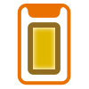

[Back to the summary](../Components.md)

#  SafeAreaPadding

This script trust the return value of [`Screen.safeArea`](https://docs.unity3d.com/ScriptReference/Screen-safeArea.html) and pad the `RectTransform` accordingly. If you anchor your child UI game objects on the padded side of the parent with `SafeAreaPadding`, you have avoided the notched area naturally with uGUI's auto-layout system.

## Android & `Screen.safeArea`

For Android to work, **your player's phone has to be on Android P AND also you have to use Unity 2019.1 or over**. Otherwise I believe Android builds with black bar over the notch/cutout (Maybe with [LAYOUT_IN_DISPLAY_CUTOUT_MODE_NEVER](https://developer.android.com/guide/topics/display-cutout/#never_render_content_in_the_display_cutout_area)) and non-Pie Android do not have a dedicated API to report cutouts.

## How it works

It can "drive" the `RectTransform` thanks to `ILayoutSelfController` and `UIBehaviour`. Meaning that several values will be greyed out so you can't modify it by mistake.

- You should attach this script to a direct child of top level `Canvas`, or a deeper child of full-canvas `RectTransform`.
- It will drive the anchor point to full stretch. The `RectTransform` now enters "offset from each side by how much" mode.
- `Screen.width/height` is divided by values from `Screen.safeArea`, producing relative safe area.
- Find root game object from the object with `SafeAreaPadding`. This should be your `Canvas`. It will ask for `RectTransform` coordinate from that `Canvas`.
- Then it will drive self's `RectTransform` other values according to relative safe area applied to `Canvas`'s `RectTransform`.

## `Screen.cutout` research started

New entry in **Unity 2019.2**, this time not just a safe area but it returns a rectangle **surrounding the notch**! Currently Notch Solution do not use this anywhere yet, but I am conducting a research to see what the phone reports for this property.

If you have a phone with cutouts, you could **join the research** by downloading a debug APK in the [release page](https://github.com/5argon/NotchSolution/releases). Then after running it on your phone, take a screenshot on both portrait and landscape orientation and submit your result in [this issue](https://github.com/5argon/NotchSolution/issues/2) so we know what it actually looks like, and we might be able to make use of it in the future! Thank you!

## Settings 

### Padding modes for each side

For each side in your current orientation, you can select from 3 modes.

- **Safe** : Pad this side according to `Screen.safeArea`.
- **Safe Balanced** : Pad this side according to `Screen.safeArea`, but if the opposite side has a larger padding then pad by that value instead.
- **Zero** : The padding will be zero, edge of your `RectTransform` will be locked to the canvas's edge.

### Orientation Type

If your application supports both portrait and landscape you could choose `DualOrientation` here. But such a game is rare so the default value is `SingleOrientation`. The choice will only show up if your Player Settings is configured such that both orientations are possible.

When you use `DualOrientation` your prior padding settings will become the portrait ones, and you will get a separated landscape paddings to setup. Your previous orientation will no longer applied to landscape orientation. If you switch back to `SingleOrientation` the portrait paddings works for both orientations again.
