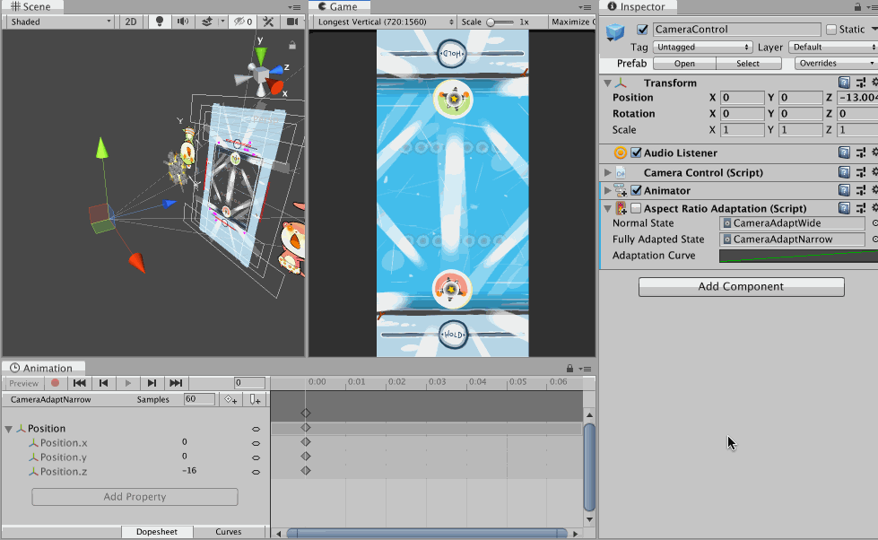
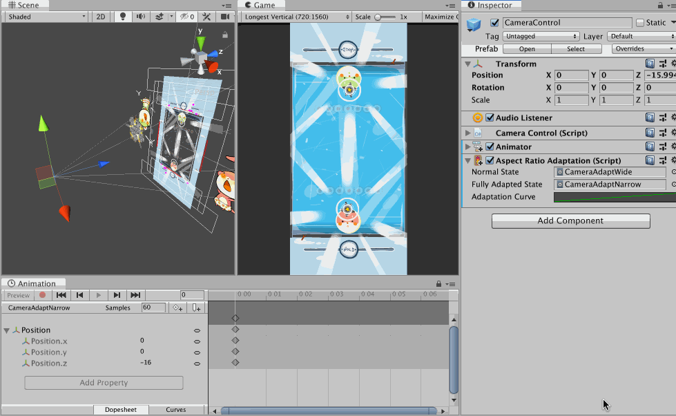

#  Aspect Ratio Adaptation

An adaptation where the time value for the adaptation curve came from screen aspect ratio number. The number is always assumed to be width/height regardless of game's orientation, so for example, it is always 1.3333 (4/3) for iPad. You could use this to **indirectly** fix notch problem, without knowing if the notch exists or not. (Things respond to aspect ratio and not the notch.)

This gif demonstrate the problem of non uGUI objects when the aspect ratio changes. The camera shrink horizontally on narrower device when on portrait orientation. Before, I prepared a stage so that on iPad there are non-gameplay extra spaces around and could be cropped safely.

(It is not even safe anymore nowadays since I assumed the narrowest was 16:9 in the past, now it goes beyond 2:1 and clips even more edge out of the stage.)

However this assumption is no longer safe with an arrival of notch trend, since narrower device *horizontally* could possibly have lesser *vertical* space. It could make the control at top and bottom edges difficult to use.

With `AspectRatioAdaptation`, I could dynamically change *anything* according to aspect ratio number. Notice that nothing on the scene moves with notch on or off, because it adapts to aspect ratio and **indirectly** fix notch problem.

In this example, in addition to the camera narrowing normally by Unity, I want it move a bit backwards with `AspectRatioAdaptation` when it gets narrower. Because of perspective settings, moving a camera backwards will scale everything down, make room on the top and bottom, and in turn create a space for notch. We have avoided the notch without querying for an existence of notch this way.

Additionally, you see that the stage itself expands vertically a bit too as a finishing touch. This affects gameplay a bit but overall looks nicer on narrow device than using the same stage shape as iPad aspect ratio.

The 2 clips on the camera in this example are each just a single frame keyed as `z = 13` for normal state and `z = 16` for fully-adapted state. The `adaptationCurve` is set so that time 1.3333 evaluates to 0, and time 2.1667 evaluates to 1. And 1.3333 is an iPad's aspect ratio, so it get fully normal state clip. If you use iPhone SE which has 16:9 ratio (1.7778), you would get somewhere between these 2 clips. (2.1667 is calculated from LG G7's ratio, I think it is the narrowest/longest phone right now.) You can see at the corner that `z` is really -13 when the game view is on iPad aspect.