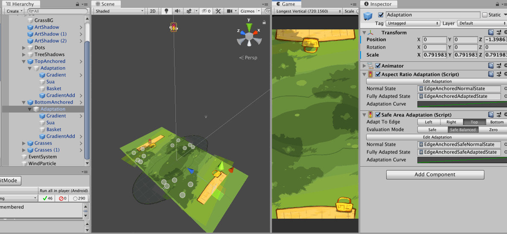

#  Safe Adaptation

This is like `AspectRatioAdaptation` but this time, the time value to evaluate the Playable graph is a **relative screen space taken** by a **single side** of safe area.

In this image, I show that both adaptation components could be used together to drive different things on the same object hierarchy, with a single `Animator` for Animation Playables API.

- `AspectRatioAdaptation` is first used to move the camera up in the case of narrow screen, so I get similar horizontal range but expose more vertical range due to perspective setup. That makes the picnic mat which was planned to be at the bottom edge of camera frustrum exposed.
- So an another `AspectRatioAdaptation` is used on the mat to move its Z position back to maintain the look of a mat sticking out from the edge of the screen.
- However we have one more problem that is if the notch is present in this adapted narrow phone state, the mat on the top side got occluded out too much.
- So I could add one more fix with `SafeAdaptation`, this time driving a bit of Z *scale* of the mat.
- Because you must select a single side, I choose `Top` for both adaptation of top and bottom mat because some Android phone doesn't have bottom safe area data padded in like an iPhone. Or you could choose `Bottom` with `SafeBalanced` and it will check out the opposite side and use it if the padding is larger.

The default adaptation curve is `0, 0` to `0.0542, 1`. This `0.0542` is relative screen space taken by the top notch of an iPhone X. I believe it is the largest notch out there so I think it is a good default. That means when you play with Android phones with a cutout you will likely get less than fully adapted state. Anyways, you should be debugging in editor on iPhone X overlay when using this feature.