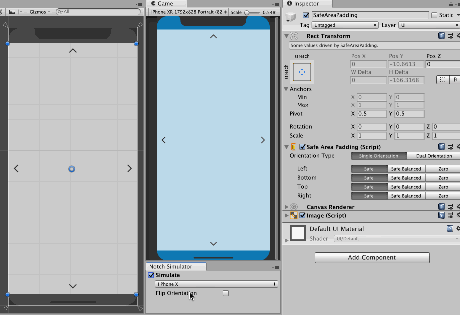

#  Safe Padding

`SafePadding` component trust the return value of [`Screen.safeArea`](https://docs.unity3d.com/ScriptReference/Screen-safeArea.html) and pad the `RectTransform` accordingly. If you anchor your child UI game objects on the padded side of the parent with `SafePadding`, you have avoided the notched area naturally with uGUI's auto-layout system.

## How it works

It can "drive" the `RectTransform` thanks to `ILayoutSelfController` and `UIBehaviour`. Meaning that several values will be greyed out so you can't modify it by mistake.

- You should attach this script to a direct child of top level `Canvas`, or a deeper child of full-canvas `RectTransform`.
- It will drive the anchor points to full stretch. The `RectTransform` now enters "offset from each side by how much" mode.
- `Screen.width/height` is divided by values from `Screen.safeArea`, producing relative safe area.
- Relative values are not usable, it bubbles up until found a `Canvas`. It will ask for `RectTransform` from that `Canvas` to make the relative value meaningful.
- Then it will drive self's `RectTransform` other values according to relative safe area applied to `Canvas`'s `RectTransform`.

## Settings 

### Padding modes for each side

For each side in your current orientation, you can select from 3 modes.

- **On** : Pad this side according to `Screen.safeArea`.
- **Balanced** : Pad this side according to `Screen.safeArea`, but if the opposite side has a larger padding then pad by that value instead.
- **Off** : The padding will be zero, edge of your `RectTransform` will be locked to the canvas's edge.

Note that each side is referring to **the device** not its `RectTransform` this component is attaced to. (e.g. top = top edge of the phone.) Therefore, even if the entire canvas is rotated 180 degree, the "top" is still referring to the top edge of the phone.

### Orientation Type

If your application supports both portrait and landscape you could choose `DualOrientation` here. But such a game is rare so the default value is `SingleOrientation`. The choice will only show up if your Player Settings is configured such that both orientations are possible.

When you use `DualOrientation` your prior padding settings will become the portrait ones, and you will get a separated landscape paddings to setup. Your previous orientation will no longer applied to landscape orientation. If you switch back to `SingleOrientation` the portrait paddings works for both orientations again.
