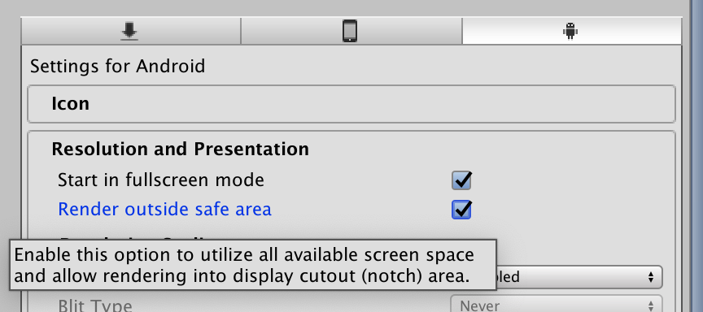

Whether you like it or not, the time has come for us designers to design in context of a notch and embrace it instead of hiding it. This tool also enables design-time preview which help you iterate your design without building the game.

- [Components](components/overview.md) to attach to your `GameObject`, they will stay safe by staying inside [`safeArea`](https://docs.unity3d.com/ScriptReference/Screen-safeArea.html) and out of the way of any [`cutouts`](https://docs.unity3d.com/ScriptReference/Screen-cutouts.html).
- [Notch Simulator](simulator/notch-simulator.md) to iterate your design in editor with various devices available. See the components react immediately without building the game or access to real devices.

**GitHub page** : https://github.com/5argon/NotchSolution

## Requirements

- Minimum Unity version 2019.1, supports `safeArea` based components. Components that uses `cutouts` do nothing.
- Unity version 2019.2+, additionally supports `cutouts` based components. (None yet, in developement.)
- Unity version 2019.3+, additionally supports [integration with Device Simulator](simulator/device-simulator.md).
- Your game's Android player has to use high enough Android version to report useful `safeArea`/`cutouts` information to Unity. Otherwise the components will not help avoiding the notches.

## It's open source

At first I am going to make it a normal Asset Store package like my other works. But I realized that this is the first one that is [not](http://exceed7.com/introloop/) [so](http://exceed7.com/native-audio/) [niche](http://exceed7.com/native-touch) in its use and could have widespread benefits to many, and as an open source that effect could be multiplied greatly. I only see notched devices increasing in the recent year.

I am not sure if I could come up with an another package with this potential, so I decided to take this opportunity for the first time. There is really no strings attached if that is what you were worrying. What I get by doing this?

- Screen cutout problems can be solved collaboratively. With so many devices in the world the problem space is HUGE. I think there are many variations and potentially different permutation of problems that bound to happen later. Over time, having more inputs from users together we could make this more stable than I could ever made alone.
- (Coming soon) The Asset Store version is a donation ware, so that opens a different way of "selling" the package. You get nothing special other than a purchase record so you can get the asset more easily and updates more easily. You get exactly the same function by grabbing everything [from GitHub](https://github.com/5argon/NotchSolution) for free.
- I get exposure to my other products, where you can expect similar quality to Notch Solution.
- There is even a Sponsor button on top of [GitHub page](https://github.com/5argon/NotchSolution), that way you could have some Unity tools in return as my thanks for a contribution. (Thank you!)
- It is not necessary a bad financial/business move. The author of the popular [Odin Inspector](https://odininspector.com/) has [open sourced their Odin Serializer](https://devdog.io/blog/odin-serializer-goes-open-source/) with good reasons.

There is really no hidden fee or anything in this product.

## Getting started

### 1. Install

- If you have access to the Asset Store donation ware version (coming soon), install and update using the usual way. When Unity Package Manager (UPM) is able to go directly to Asset Store, then you could do it that way too.
- If you don't, you can pull directly from GitHub with UPM's Git functionality. Add this line `"com.e7.notch-solution": "git://github.com/5argon/NotchSolution.git",` to your `manifest.json`. However it will not update automatically when I push fixes to this repo. You must remove the lock line that appears in you `manifest.json` file to refetch.

The package is properly "UPM shaped" with [assembly definition files](https://docs.unity3d.com/Manual/ScriptCompilationAssemblyDefinitionFiles.html). If you also use one, the name of an assembly to link is `E7.NotchSolution`. C# namespace is also `E7.NotchSolution` if you want to extend the built-in components.

### 2. Use the components, iterate with the simulator

Learn and use available [components](components/overview.md) in your design. Use [Notch Simulator](simulator/notch-simulator.md) to validate the design instantly.

You can also see the [how-to section](how-to/index.md) for some tricks and recipes.

### 3. Set the Project Settings before you build

All the work for this moment. Enable **Render outside safe area** under **Resolution and Presentation** for Android. Otherwise you get black bars.

For iOS, I think there is no option to do black bar as Apple discourages and may denies app that tries to hide the notch, therefore it already renders outside the safe area.

### 4. License

[The license is MIT](https://github.com/5argon/NotchSolution/blob/master/LICENSE). You should do your part in the open source software movement.

## See Notch Solution in action

I have in fact dogfood my own plugin so you don't have to worry much if the support for the package dies out because of "no demand", I demand it myself. The same goes to my other products.

The game is called [Duel Otters](https://duelotters.com/) which is free. Notch Solution is especially important in this game since it is a 2-player game where the other player will have to be on the notched side. Try it with various devices and see the UI adapts!