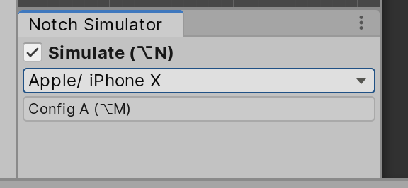
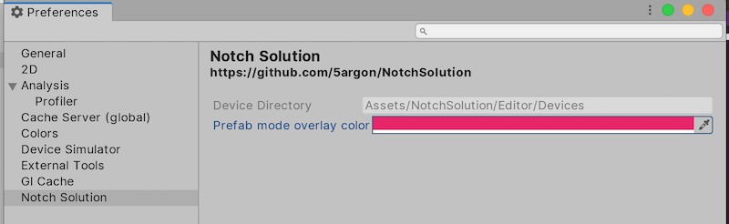

# Notch Simulator

Many of Notch Solution's [component](../components/overview.md) rely on [`Screen` API](https://docs.unity3d.com/ScriptReference/Screen.html), which the value such as `safeArea` or `cutouts` are not useful until in runtime.

- Notch Simulator helps tell those components (which are all `INotchSimulatorTarget`) a simulated safe area and cutouts for use at design time. You will see them adapt immediately on toggling on-off the simulator or changing devices so you can iterate your UI design.
- It also shows an overlay of respective device to help you better picture the obstacles on the screen.
- It even works in the prefab mode, or as called [`PrefabStage`](https://docs.unity3d.com/ScriptReference/Experimental.SceneManagement.PrefabStage.html) programmatically.

The tool is accessible from `Window > General > Notch Simulator`. Then you can dock it somewhere. The simulation will not happen if the panel is not present, all simulation occurs in `void OnGUI()` of that `EditorWindow`.

## Workflows

### Toggling

Use the check box to turn on-off the simulator so you see if your UI looks great on device with or without `safeArea` or `cutouts`.

Additionally with Shortcuts API introduced in 2019.1, you could press `Alt/Option + N` to toggle it to confirm your design. It could be adjusted in the `Shortcuts...` preference menu.

### Configuration switching

"The configuration system" let you quickly switch between 2 configs. A common desire is not to just toggling on and off the simulation, but also switch around the device. Commonly between 2 extremes such as iPhone vs iPad.

By clicking on the word "Config A" it will change to "Config B". If you change the simulated device while in "Config B", it will be remembered to this configuration instead. After you have finished setting up your A and B it is easy with shortcut `Alt/Option + M` to switch A-B repeatedly and see if the design works on both or not.

The configuration system even has a separated A and B **per build platform**. If you were working on iOS and switched to Android, then you are allowed to have one more set of A and B configs. When working on Android it could be Galaxy Note 10+ and Galaxy S10+ instead of iPhone and iPad, for example.

## How it works

If you found some bugs or want to mess with the code this should be helpful :

- The simulator maintains 2 `Canvas` game objects, one in the normal scene and one in the prefab environment scene. They are with `HideFlags` that make it invisible on Hierarchy and do not get saved.
- `AssetDatabase` uses a fixed GUID to go to an overlay collection folder and load the correct one.
- Those `Canvas` is on "Screen Space - Overlay". with high sort order. Effectively any image put on this should be on top of everything.
- You need to set the game view to match your simulation device choice or it would looks weird.
- Portrait or landscape orientation is determined from width vs height of the current game view's size. The overlay will be flipped accordingly.
- All `INotchSimulatorTarget` found will be sent a simulated `Rect` of `safeArea` and `Rect[]` of `cutouts`. You can keep the data in the component to use it later.

The overlay is also useful for aiming roughly what can fit in the corner around the notch, because you can see the notch's width and also rounded corner visually where safe area does not cover such information. (Safe area is a rectangle.) Although please note that Apple advise against intentionally trying to design on that gap.

## Preferences

There is a preference menu available. For example you could change prefab mode overlay color to be different from Game view ones.