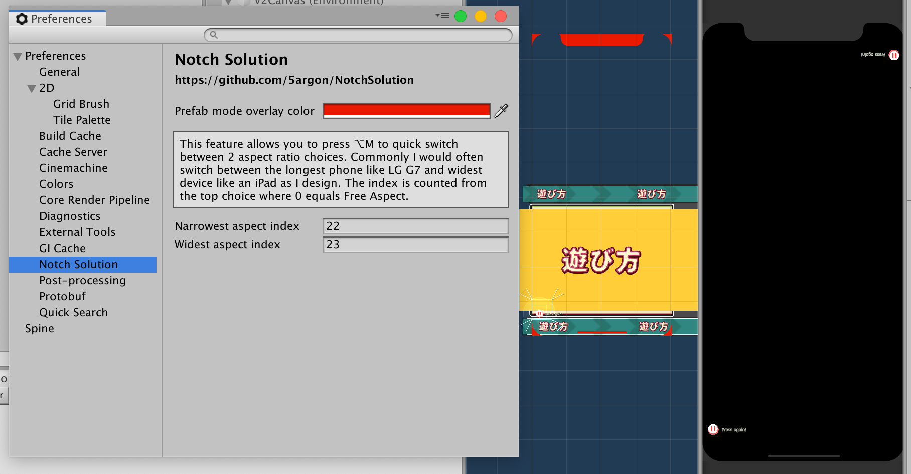

# Changelog
All notable changes to this project will be documented in this file.

The format is based on [Keep a Changelog](https://keepachangelog.com/en/1.0.0/),
and this project adheres to [Semantic Versioning](https://semver.org/spec/v2.0.0.html).

## [1.6.0] - 2019-06-22 

### Added

- Add an editor button for creating all required assets for adaptation components.
- Add an editor button for temporarily assign the controller asset so you could design the adaptation in Animation panel. (Usable with asset created from the prior button.)
- Documentation structure refactored. (Contributed by [06Games](https://github.com/06Games))

## [1.5.0] - 2019-06-20 

### Added

- "Adaptation" components added. This series of components could adapt anything including non-UI stuff with help from **animation playables API**. This is needed because with `SafeAreaPadding` we were relying on uGUI layout system to move the entire hierarchy tree, and it is not usable outside of uGUI. The adaptation component is more flexible, as long as something is animation keyable, it could be responsive to a presence of notch & other things.
    - `SafeAreaAdaptation` :  Adapt according to relative screen space taken by a selectable single side of safe area.
    - `AspectRatioAdaptation` : Like `SafeAreaAdaptation` but use aspect ratio number of the screen. Doesn't sounds notch-related, but it is a part of "notch solution" because I have use this together to solve arrangement problems.
- New script icon for `SafeAreaPadding` since I lose the original vector project file, and I want the newly made component icons to look similar to it. ([Affinity Designer](https://affinity.serif.com/en-gb/designer/) icon project file is also added to `Icons` folder in the repo now to prevent losing it again.)
- Cutout information propagated to layout components, but currently unused.  (Contributed by [06Games](https://github.com/06Games))

### Fixed

- Code refactor throughout.
- Sometimes the overlay mockup didn't update its overlay graphic. Added a new destroy-create routine to force refresh it. (Contributed by [06Games](https://github.com/06Games))

## [1.4.0] - 2019-06-04

### Added

- Preference item added under "Notch Solution". You can adjust overlay color of prefab mode there.
- New shortcut to quick switch between 2 Game view aspect ratio. Set this up in the preference menu. This is ideal for mobile development where if you could ensure that narrowest and widest screen looks nice, everything in-between should also work.
- Overlay for Samsung Galaxy S10 and S10+ added. (Contributed by [06Games](https://github.com/06Games))
- Tree simulation device enum selector for 2019.2+ (Contributed by [06Games](https://github.com/06Games))

## [1.3.0] - 2019-05-28

### Added

- `influence` added to `SafeAreaPadding`, it is default to 1 that means the safe area taking full effect. It applies to all sides.
- "Dual Orientation" choice now only show up in Inspector if in your Player Settings, Resolution and Presentation section, you have Orientation settings in a way that it is possible to get both portrait and landscape orientation.
- Shortcut for toggling notch simulation added with the new `UnityEditor.ShortcutManagement` shortcut API. Bound to `Alt+N` by default.
- Cutout database for all available devices. Although they are not used yet currently.

### Fixed

- Removed `[ExecuteInEditMode]` from `SafeAreaPadding`.
- Simulation database for One Plus 6T and Huawei Mate 20 Pro was incorrect. It is now updated according to submitted debug data in [this thread](https://github.com/5argon/NotchSolution/issues/2).
- `HideFlags` mistake fixed.

## [1.2.0] - 2019-05-18

### Added

- Prefab mode ([`PrefabStage`](https://docs.unity3d.com/ScriptReference/Experimental.SceneManagement.PrefabStage.html)) suppport added. There is now an overlay while editing a prefab, so you could design "full screen canvas as a prefab" in isolation while preview the notch. Previously you must save the prefab first, the see the update in Game tab while Scene tab is still in prefab mode. Note that `PrefabStage` is in experimental namespace, it is bound to break in future version.
- New simulation device : iPad Pro. From running screen query on the Xcode simulator, the iPad Pro do have a safe area of 40px for that black line at the bottom (both orientations), plus small curved corners.
- Added a changelog.

### Fixed

- Aspect ratio number in the Notch Simulator warning help box is rounded to nice number.
- `SafeAreaPadding`'s delayed update is now using `WaitForEndOfFrame` instead of wait for the next frame.

## [1.1.0] - 2019-02-11

This is not an actual version since I just keep a changelog starting from 1.2.0, but I will list notable changes here off the top of my head.

### Added

- Debug scene added. It is now possible to distribute a test APK to collect cutout data of various phone. 2019.2's `Screen.cutouts` is supported in the debug scene, but no actual use by the `SafeAreaPadding` yet.
- Overlay color matches Personal and Professional skin.
- Two new devices: Huawei Mate 20 Pro & OnePlus 6T. (Contributed by [06Games](https://github.com/06Games))
- Added a warning about wrong Game tab aspect not matching notch preview device.
- Added a `README.md` documentation.

### Fixed

- `OnEnable` of `SafeAreaPadding` changed to delayed update. (Contributed by [Froghut](https://github.com/Froghut))
- Screen ratio function fixed. (Contributed by [06Games](https://github.com/06Games))
- Get the correct root canvas when you have multiple nested `Canvas` on the hierarchy. (Contributed by [mmatvein](https://github.com/mmatvein))

## [1.0.0] - 2018-12-27

The first version!!
