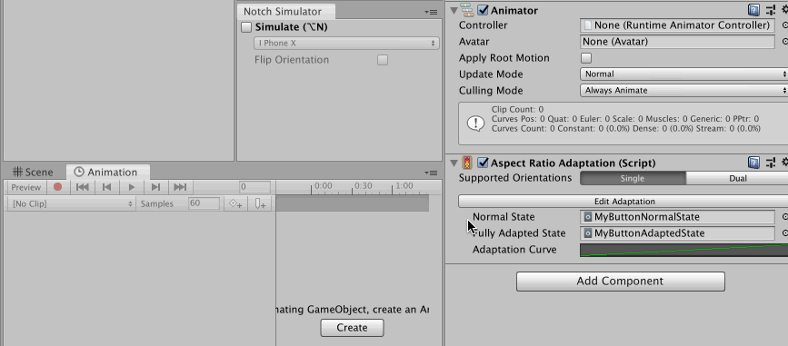
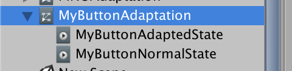

# Adaptation Components Overview

For non-uGUI objects, sometimes there are controls waiting to be raycasted by something like `Physics2DRaycaster` to trigger the `EventSystem` just like UI objects. Notch could make those objects difficult to touch, but this time we have no help from uGUI layout system to move things out of the way.

How "adaptation" components works is that it could move things out of the way with help from Animation Playables API, which uses `Animator` component only as a playable output of `AnimationClip`, *not requiring* a controller asset assigned.

## So what is a Playables?

[This API](https://docs.unity3d.com/Manual/Playables.html) is quite nortorious to be overly abstract and difficult to understand. Documentations are scarce and confusing, the concept is not immediately relatable, and not many people that manage to use it made any tutorials.

Basically, you can "play the whole thing" (`PlayableGraph`) and something in that whole thing (`Playable`) know the **time** is moving forward, it should do something. Something will happen at the output (`PlayableOutput`). The key take away is that the whole concept is related to time. Playing is the act of continuously moving forward time.

Audio and animation both comes to mind immediately as they are (literally) a playable thing. But you can also make a custom `ScriptPlayable` to do anything you want as the time passes. Maybe you make a `PlayableBehaviour` that `GC.Collect` every 2 minutes while the graph plays, for example.

"Who" is the one running the playables is in mystery deep in the engine code, maybe you can think there is an invisible `GameObject` with coroutine running, and that routine advances the time each frame.

The way I use Playables is not really to play, but I just want the "apply" effect of animation playables. So just create a playable graph, "evaluate" (a term for playing *at* only a specified time), then destroy it.

What's great is that the playables could be designed as a graph, and you can set a weight on the branch. In audio, the weight can express how much volume to mix from each `AudioClip`. For animation, we could blend controlled result between 2 `AnimationClip`.

## The design

We will have 2 **single-frame** `AnimationClip` that represent "normal state" and "fully adapted state". These clips could control just about anything keyable, and the evaluated value could be blended anywhere between 2 clips thanks to playable weight explained earlier. What to use as a blend depends on component. `SafeAdaptation` leans toward fully adapted state `AnimationClip` the more screen space was taken by safe area, for example. That blend value could additionally go through an `AnimationCurve` so you can design your own interpolation of the blend.

By piggybacking on the animation system, this allows adaptation component to gain a good editor to author what and how you want to adapt automatically : the Unity Animation panel.

All adaptation components will adapt once **only** on `Start()` since unlike uGUI's layout system where all the edges and sizes cause ripple effect, it is not expected that the value controlling the adaptation will change often. (Aspect ratio couldn't change mid-game, notch couldn't expand mid-game, etc.) However you could still adapt again manually by calling `Adapt()` on it.

## Editing the adaptation clips

Playables API requires an `Animator` component as a playable graph's output target, however the controller asset is not needed so just add an empty `Animator` and fold it away. (It must be `.enable = true` though.)

Unfortunately without the controller asset **connected** to `Animator` component, you cannot use the Animation tab to design the 2 adaptation clips. As a workaround to maintain good workflow, I have added a toggle button so that it assign the controller temporarily while it is pressed. After you are done remember to toggle it off to remove the controller asset.

This button only appears if both clips are under the same controller asset parent. You could ensure that by creating all required assets with an another button that should appear around the same place, when you are still missing clips.

## Problems with this approach

All the adaptation component has `[ExecuteAlways]` so you could see the adaptation live, however unlike uGUI layout based "driven" properties, Playables API modify the properties for real, and without help from [`AnimationMode`](https://docs.unity3d.com/ScriptReference/AnimationMode.html) to revert the changes as you may have seen from when making animations normally or using the Animation Track in the Timeline.

Why can't we use `AnimationMode`? Because in Animation or Timeline's case, we are explicitly in a "preview/design mode" when working on them. And the thing we worked on is only one at a time. (One `Animator` at a time) So going in and out from that design mode maps well to starting and exiting `AnimationMode` and reverts all the changes. In our case, we want the notch/ratio switch to affect everything active. We are not in any kind of preview/design mode so reverting is not possible. While it maybe possible to count notch display as design mode and revert modification once we get out of it (I'm sure tons of bugs are waiting if I am going for this), switching aspect ratio on the other hand we may prefer to work on that ratio for an extended time and it is not really a preview.

Why the for-real modification problematic? Mainly with prefabs system where it will override (bold and blue-line) your property. This overriding makes that field disconnected from the actual prefab and stop receiving any more updates from upstream prefab. In most cases however, the upstream will also has this adaptation component inside that propagated out, so that update it would have received if it wasn't overrided would be the same anyways. Still, it cause annoying noise in places like the override summary dropdown. Thankfully it seems to not dirty the scene and cause save asterisk to appear.

Possible solution : Make a dedicated aspect ratio preview or notch preview as a "clutch shortcuts" so you must hold the key, and it is obvious that you must release the key to revert it at some point, allowing us to revert changes by using `AnimationMode` on using the clutch shortcuts.

Why uGUI layout can avoid dirtying everything on aspect change or layout change? When you see your UI moves around actually most of their `RectTransform`'s fields remains the same. It is an effect of its parent that move them without actually modifying their values. (Thanks to relative value design, like size **delta** or **anchored** position.) The parent that has changing values avoid the dirty with `DrivenRectTransformTracker`, which seems to be a part of `AnimationMode` API too. However it only works for `RectTransform` plus this must be registered to properties via scripting (things like `Vertical/HorizontalLayoutGroup` explicitly tell it to track part of the rect inside the code.), and not usable when we allow keying just about anything in the Animation tab. It seems we have to live with this cons.