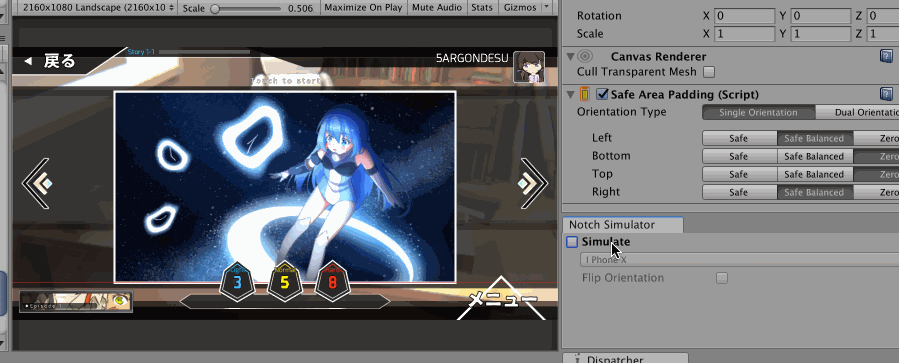
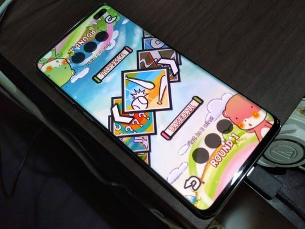
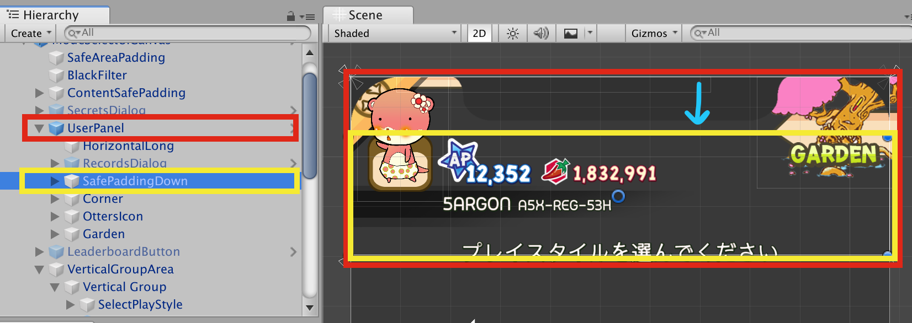
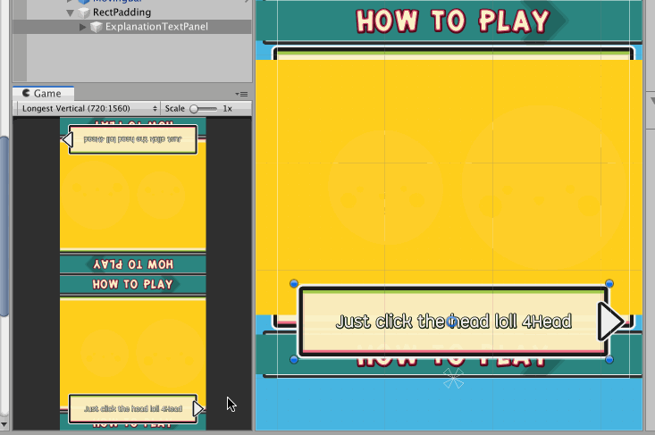
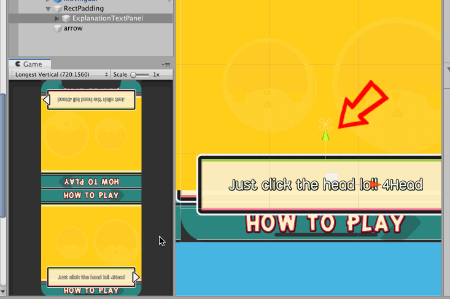
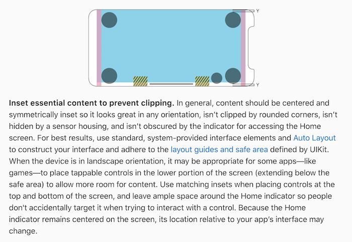
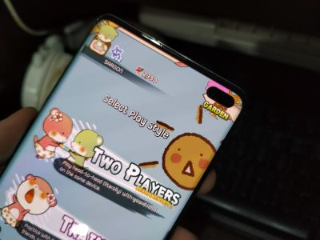
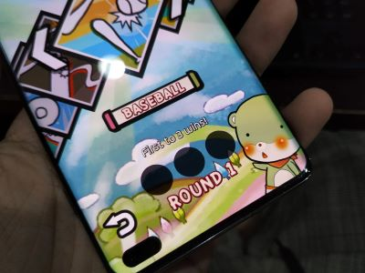

# How-to and tricks

Useful design patterns will be added here for guidance.

## Using "Safe Balanced"

"Safe Balanced" is for example, you are making a landscape orientation game and there are left and right arrows which supposed to stick to the left and right edge of the screen.

With notch present, there maybe a case that only notched side will move in which might looks odd depending on your game. You may use `Safe` on the notch side and `SafeBalanced` on the opposite side to offset the non-notch side by the same amount. Or just use `SafeBalanced` for both.

Anyways, iPhone X's safe area on landscape is balanced on both notched side and the opposite side, so Safe Balance has no effect. But who knows other Android phones may report safe area that offset in on just the notched/cutout side, so using Safe Balanced will guarantee the balanced appearance.

I have been dogfooding my own plugins using my own game, here's an another case on using Safe Balanced. The bottom side do not have any safe area padding yet is padded according to the top.

In my opinion, balanced padding make more sense on landscape layout.

## Hierarchy planning for `SafePadding`

This "SafePaddingDown" `RectTransform` has `SafePadding`, but it is not a direct child of the full-screen canvas, yet it can still pad down equal to top edge's safe area. So as long as its top edge is at the top of canvas it can be anywhere in the hierarchy and **looks like** it is a direct child of the canvas. This is useful when you may have deep prefab layering where it is not possible to get your thing to be a direct child of the outmost rect.

Also, you can make a rect anywhere else to pad equal to safe area's shape even if its edge is not lining up at the canvas's edge, or not shaped in the same aspect as the screen, for example. The script does not care and just stretch out the rect and pad equal to safe area true to its name. This is intended behaviour and you may exploit it as you like.

## How to pad by less amount than the safe area without using `influence`

Sometimes the original anchoring already has a bit of padding with normal phone. But this padding is not enough with notched phone, so we want to use `SafePadding` on outer element and anchor the inner element to the desired side.

But when padded it looks a bit "too safe", because the original padding now adds up to the safe area. Especially if that padded area is not quite the interaction zone, so even if it padded a bit less it would be considered still safe (to pull up that bottom bar, etc.)

You could use `influence` field on the `SafePadding`, but you may not want it to affect other `RectTransform` that may be under the same parent.

One another solution is to creatively use non-edge (custom) anchoring so that the gather point is moved up, but not really at the center yet. (Where if the anchor point is at exact center, the padding would not influence the layout at all.)

This way, you already have an adjustable influence **only for this `RectTransform`** how much the padding should affect. Make sure the upper side with notch is still not sinking in the case that you are using `SafeBalanced` mode. Also check your UI well with other aspects such as iPad - iPhone if it still translates well under this "hack".

## You can go below the safe area on landscape iPhone

From [this design guide](https://developer.apple.com/design/human-interface-guidelines/ios/visual-design/adaptivity-and-layout/), Apple stated that it is fine for games to dip below the safe area made for that black bar, **as long as they are far from the bar**. (Do not get near the yellow area.)

Also the remarks about matching insets, it is exactly what `SafeBalanced` mode could do so try using it. (The `Y` gap you see at top and bottom is equal, even though the safe area is not present on the top.)

## How do I conditionally pad or not pad depending on available "hole"?

When using `SafePadding` you may face this dilemma : It already looks nice on iPhone X because the UI stays in the "hole" made by that center notch. You could say it is "unsafe" because it is out of `safeArea` reported, but luckily it survives the notch. So you **skip** using `SafePadding` on it. No device will probably have any bigger notch than iPhone X anyways, or so you thought.

However you forgot a device like Galaxy S10+ exists. Thanks Samsung! Which put a notch at the location you thought staying unsafe is probably fine. Now the hole punched through and you want to use `SafePadding` to move it down. However by doing so now on iPhone X it is also moved down, that hole looks like a wasted opportunity for something to be there.

Next example problem, if your game allowed upside down portrait orientation. This back button is correctly moved up on S10+. But the "Round 1" at center ideally shouldn't, there is plenty of space below it. However if you do not use `SafePadding`, a device like iPhone X would now put a notch there and that wouldn't look good.

The real problem is that this "conditional" notch avoidance depends on knowledge of `cutouts` rather than `safeArea`. `SafePadding` does not support `cutouts`, so this component is not a good fit.

Components that would support `cutouts` are in development, so for now just choose your poison. I want it to look good on iPhone X so I say do not move it. On S10+ then the hole punched through but that's (kinda) OK. It could still be touched at least! For the "Round 1" problem I used `SafePadding`, so on S10+ there is that empty row but that's (kinda) OK too.