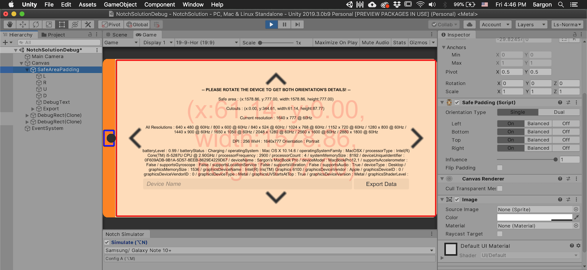
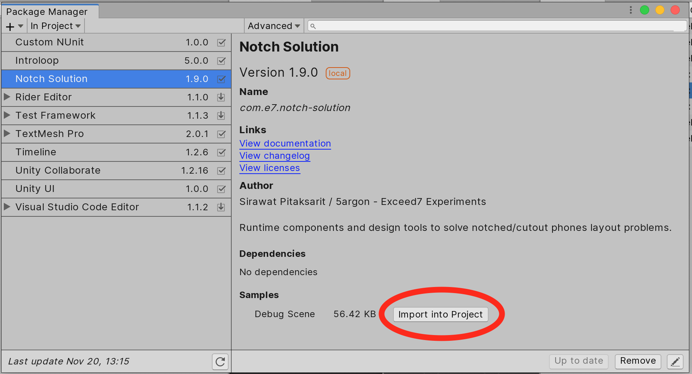
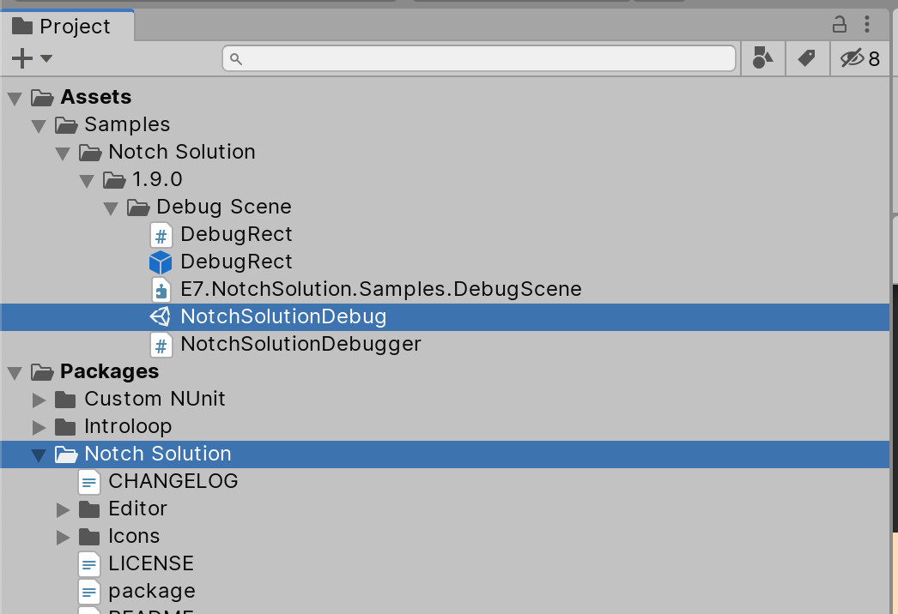
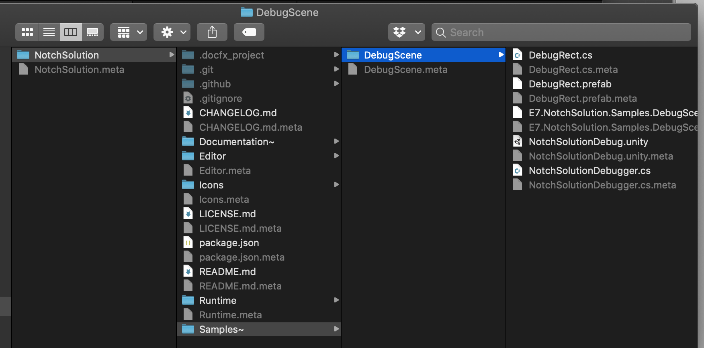

# Debug Scene

This scene displays all the information about the device (simulated or not).
It works in the editor as well as on physical devices.

The information returned consists of:
- Rectangle of the `safeArea`. This is padded from the edge of the screen.
- Rectangle of the `cutouts` (if Unity 2019.2 or later), this is the exact bound surrounding the notch, not just an overall padding like `safeArea`.
- As well as full of other information about the phone. It is a dump of everything from [`SystemInfo`](https://docs.unity3d.com/ScriptReference/SystemInfo.html).

### Prebuilt player

You could download the [latest APK](https://github.com/5argon/NotchSolution/releases/latest) of this scene or distribute that link to someone who has the device which you want to know its notch/cutouts information.

In iOS is such a hassle to distribute a TestFlight build so you better build it yourself from Unity.

### With Unity Package Manager (2019.1+)

You can see the scene in Unity and build it. If you want to rebuild, please use Mono instead of IL2CPP as it contains use of reflections over `SystemInfo` class. With IL2CPP dead code will be eliminated and we cannot reflect the class to scan for all properties that would be debugged on the screen.

If you get Notch Solution from Asset Store, you have to unzip `Samples~.zip` first, then take the package out from project, then use UPM to link to the package. If pulled from GitHub, you already have this `Samples~` folder. Take the package out from project and link with UPM.

After you use UPM to link to the package, you can see the import samples button. Press it and you will get the sample in your own project. You may [read this](https://forum.unity.com/threads/samples-in-packages-manual-setup.623080/) for details how it works.

After, you will see a folder chain `Samples/` appearing in your project. It is wrapped nicely in a package name and even in a [SemVer version](https://semver.org/) of the package. This is actually in your game project, as opposed to the package which could be linked.

After you are done you can safely delete the whole imported `Samples/Notch Solution`, all in one place without worrying "is there anything else to delete?".

This is how Samples works in modern Unity. They will stay hidden in the package (`/Samples~` folder of the package), until you want to see them **by importing** to your game.

The plugin package itself can still be linked via UPM without polluting your game's `Assets` folder, only the samples requires importing. In a way this shows that the sample works from a user's perspective. (i.e. "you can do this too")

### Without Unity Package Manager

After unzipping `Samples~.zip` if you get it from Asset Store, or do nothing if pulled from GitHub, Unity skips importing the `/Samples~` folder you see [because of trailing `~`](https://docs.unity3d.com/Manual/SpecialFolders.html), which is great so you won't have to spend time importing unrelated assets. You can go inside here **with your file explorer** in your OS and copy the content out to your project.

