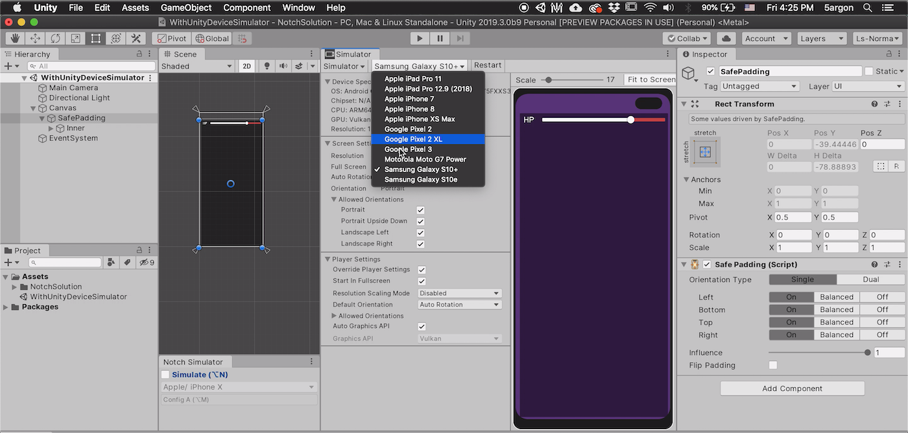
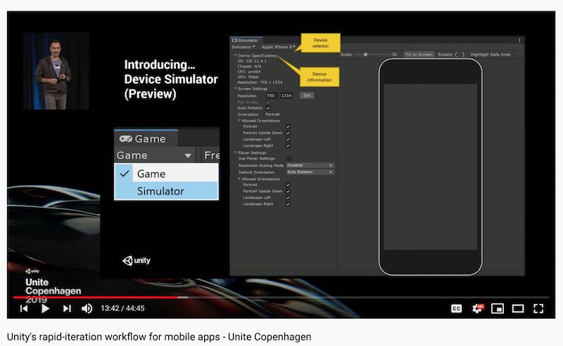
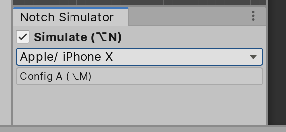

# Integration with Unity Device Simulator



- [Unity Device Simulator Package](https://docs.unity3d.com/Packages/com.unity.device-simulator@latest/) UPM page.

This package augments a **secondary `GameView`**, there is a new drop down added to your Game tab. When in this new "Simulator" `GameView`, the `Screen` and `SystemInfo` API will change depending on selected device. Therefore anything that relies on `Screen` or `SystemInfo` could be realistically presented in editor.

Also it comes with several overlays, which goes beyond the device screen to an actual device's edge. (Unlike Notch Simulator which is only the screen area.) It has more tricks than that, including simulating device temperature, etc. It is a very complete package.

Both "more than 1 `GameView`" and the `Screen`/`SystemInfo` hacking from inside-out are only available after 2019.3 in the engine code if you look at [UnityCsReference](https://github.com/Unity-Technologies/UnityCsReference/). You cannot use this package before this version.



- Watch the [Unite Copenhagen 2019 talk](https://youtu.be/KFJcMG3mlDA?t=720).

## So it supercede Notch Solution?

No! It may looked like a competitor to Notch Solution at first glance, but in fact you should use it together. Strictly, it supercede only the Notch Simulator part of Notch Solution. The "solution" part is what works together with Device Simulator.

As I said the Device Simulator hacks the `Screen` and `SystemInfo`. The simulator cannot make your game "safe", it is able to present a situation and now it is up to your game to respond to them. My Notch Solution components are that. They are something that follows `Screen` API at runtime. Only in editor that it uses values from Notch Simulator sent to `INotchSimulatorTarget`.

So the "integration" is basically, there is a code to detect that if the current `GameView` is from a type in Device Simulator Package, it is likely that `Screen` right now is being controlled to be more useful. We then can use `Screen` like in runtime instead of our simulated values. Notch Simulator stop working automatically when the Game view is switched to Simulator mode and continue working when switched out to normal `GameView`.

## So it supercede Notch *Simulator*?

```
 ___________________
( am I useless now? )
 -------------------
        \  
         \ 
```



But wait : 

- If you are before 2019.3 then you cannot use that package.
- The overlay is drawn on the Game tab with a shader. It doesn't exist on Scene tab unlike our "hacky" [full screen hidden `Canvas` approach](notch-simulator.md). If you want to see the overlay in Scene tab too then you can still find Notch Simulator useful.
- Notch Simulator also put overlay in prefab mode. If you design a piece of UI that is not right now visible on Game tab, or you don't want to press save in prefab mode to see the change that Device Simulator could affect in the Game tab, then Notch Simulator maybe still useful.
- You like the A-B configuration switch or quick on-off shortcuts in Notch Simulator then you can continue using it. You maybe able to write a custom shortcuts to Device Simulator too but I have not investigate it yet.