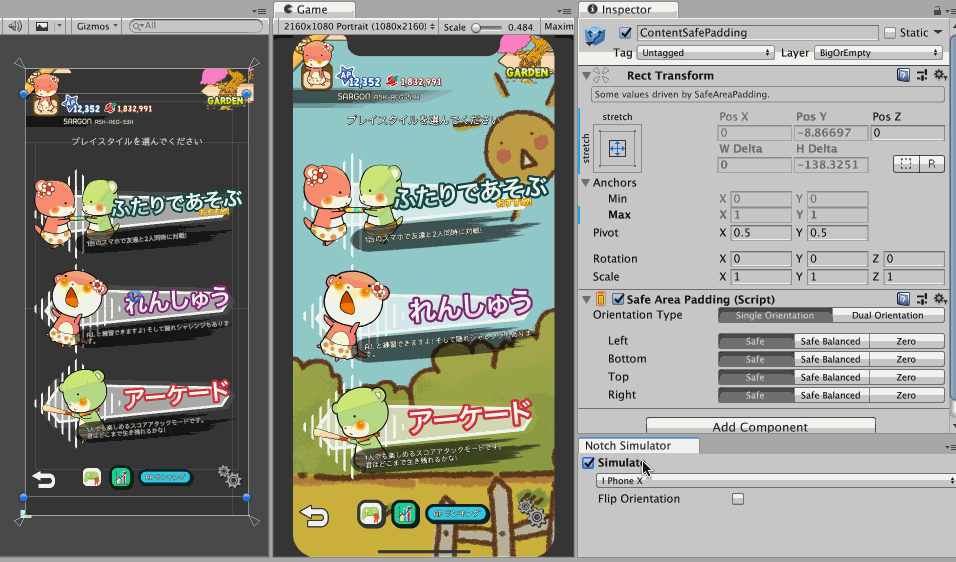

# Notch Solution

A set of components and tools to solve notched/cutout phones layout problems for Unity.

Whether you like it or not, the time has come for us designers to design in context of a notch and embrace it instead of hiding it. This tool also enables design-time preview which help you iterate your design without building the game.

**Official website** : http://exceed7.com/notch-solution/

**Questions/Problems/Suggestions** : 5argon@exceed7.com
**Discord** : https://discord.gg/J4sCcj4

## Easy way to pay for this software

Are you looking for a way to say thanks to this open source work other than code contribution?

It is easy! You can take a look at my myriad of niche Unity Asset Store **audio plugins** in [my publisher page](https://assetstore.unity.com/publishers/18007), grab something for your game, or tell your audio-caring friends about them. Thank you!

## How to use

With internet connection you should visit : http://www.exceed7.com/notch-solution

Without internet connection, the website mentioned was generated from files in [a hidden folder](./Documentation~/index.md). Currently you may see it in a zipped form `Documentation~.zip`, because Asset Store do not support publishing unimported folders yet so I have to zip them to make them go together.

Please unzip it to access the documentation. Also you can unzip `Samples~.zip` to access unimported samples, which you can copy them to your project to make them actually import.

After you get a `Documentation~` folder, you can read them in their Markdown form from your code editor. Markdowns are human readable by design. They won't be imported to Unity too, as the folder [has a trailing `~`](https://docs.unity3d.com/Manual/SpecialFolders.html). It is great because Unity will not create `.meta` files for them and not import tutorial texts and images, they are not a part of your game. The same goes to unzipped `Sample~` folder, they are not supposed to import until you want to see them. This format is currently the best practice.

With an IDE like Visual Studio Code, you can use "Markdown: Open Preview to the Side" to even display a nicely rendered Markdown with images working properly. Navigate by clicking on different files on the folder tree.

## License

[MIT](LICENSE.md)