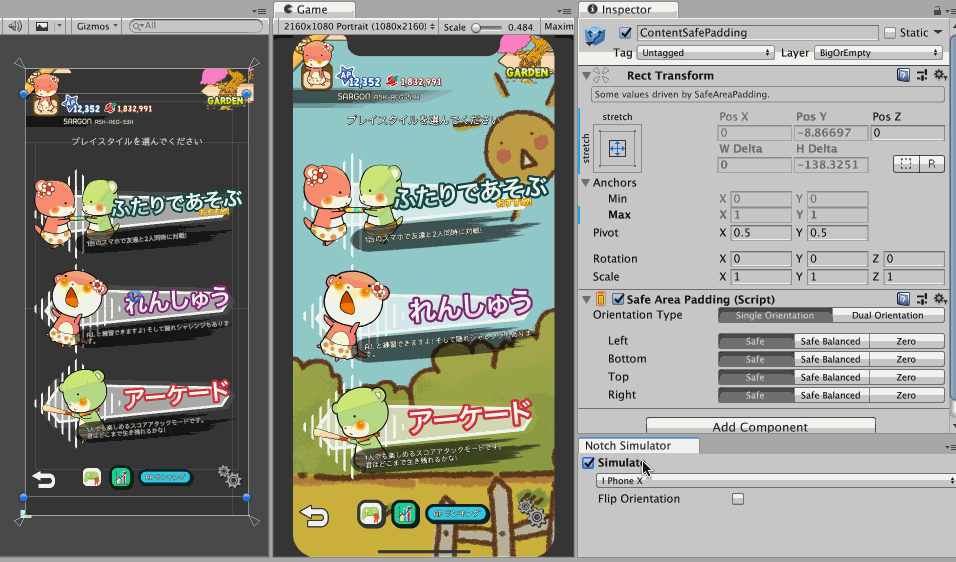
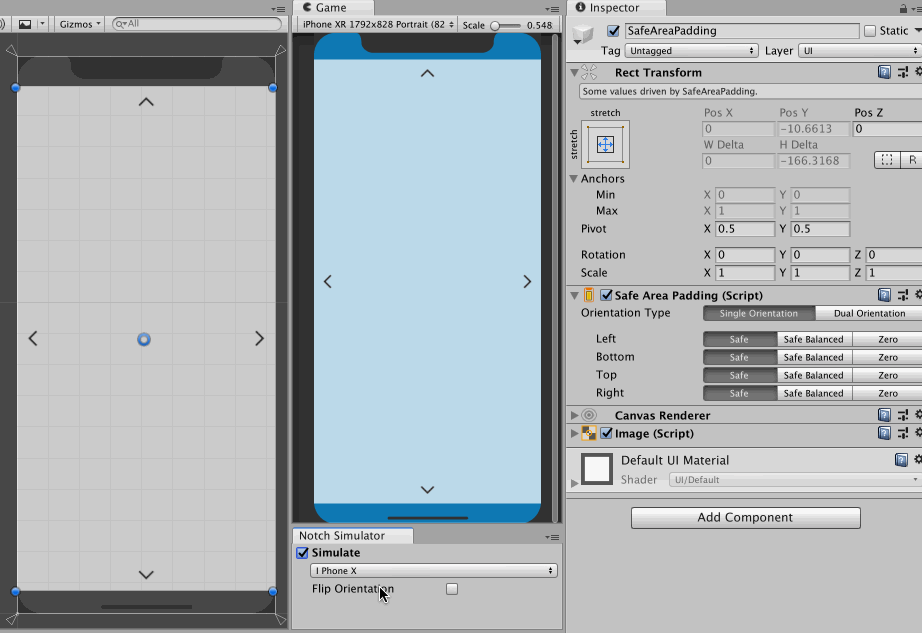
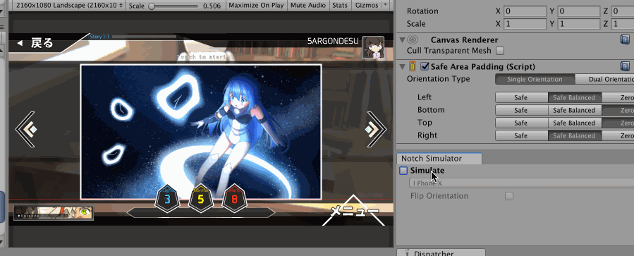
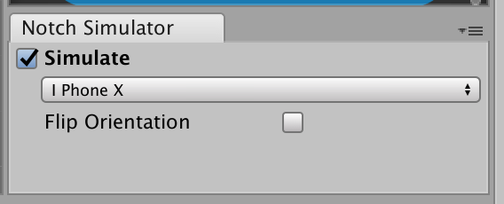

# Notch Solution

It is a set of tools to fight with notched/cutout phones for Unity uGUI.

## How to include with GitHub functionality of Unity Package Manager

Add this line `"com.e7.notch-solution": "git://github.com/5argon/NotchSolution.git",` to your packages.json

It does not update automatically when I push fixes to this repo. You must remove the lock in your Packages folder. Otherwise you would better use Asset Store.

## Asset Store

It will be on Unity Asset Store for free later because no one deserves to deal with these hideous design trend.. There are some weird glitches remaining, and many usability issue related to the isolated prefab mode. (Probably have to use the new `[ExecuteAlways]` in some way)

# SafeAreaPadding

This script trust the return value of [`Screen.safeArea`](https://docs.unity3d.com/ScriptReference/Screen-safeArea.html) and pad the `RectTransform` accordingly.

## Android & `Screen.safeArea`

For Android to work, **your player's phone has to be on Android P AND also you have to use Unity 2019.1 or over**. Otherwise I believe Android builds with black bar over the notch/cutout (Maybe with [LAYOUT_IN_DISPLAY_CUTOUT_MODE_NEVER](https://developer.android.com/guide/topics/display-cutout/#never_render_content_in_the_display_cutout_area)) and non-Pie Android do not have a dedicated API to report cutouts.

## How it works

It can "drive" the `RectTransform` thanks to `ILayoutSelfController` and `UIBehaviour`. Meaning that several values will be greyed out so you can't modify it by mistake.

- You should attach this script to a direct child of top level `Canvas`, or a deeper child of full-canvas `RectTransform`.
- It will drive the anchor point to full stretch. The `RectTransform` now enters "offset from each side by how much" mode.
- `Screen.width/height` is divided by values from `Screen.safeArea`, producing relative safe area.
- Find root game object from the object with `SafeAreaPadding`. This should be your `Canvas`. It will ask for `RectTransform` coordinate from that `Canvas`.
- Then it will drive self's `RectTransform` other values according to relative safe area applied to `Canvas`'s `RectTransform`.

## Settings 

### Padding modes for each side

For each side in your current orientation, you can select from 3 modes.

- **Safe** : Pad this side according to `Screen.safeArea`.
- **Safe Balanced** : Pad this side according to `Screen.safeArea`, but if the opposite side has a larger padding then pad by that value instead.
- **Zero** : The padding will be zero, edge of your `RectTransform` will be locked to the canvas's edge.

*TODO : **Unlocked** mode, which stop the `SafeAreaPadding` to drive just that side's `RectTransform` allowing you to manually adjust or animate it. (It looks like a pain to implement...)

### Orientation Type

If your application supports both portrait and landscape you could choose `DualOrientation` here. But such a game is rare so the default value is `SingleOrientation`.

When you use `DualOrientation` your prior padding settings will become the portrait ones, and you will get a separated landscape paddings to setup. Your previous orientation will no longer applied to landscape orientation. If you switch back to `SingleOrientation` the portrait paddings works for both orientations again.

## Tricks

### Using "Safe Balanced"

"Safe Balanced" is for example, you are making a landscape orientation game and there are left and right arrows which supposed to stick to the left and right edge of the screen.

With notch present, there maybe a case that only notched side will move in which might looks odd depending on your game. You may use `Safe` on the notch side and `SafeBalanced` on the opposite side to offset the non-notch side by the same amount. Or just use `SafeBalanced` for both.

Anyways, iPhone X's safe area on landscape is balanced on both notched side and the opposite side, so Safe Balance has no effect. But who knows other Android phones may report safe area that offset in on just the notched/cutout side, so using Safe Balanced will guarantee the balanced appearance.

### Hierarchy planning

This "SafePaddingDown" `RectTransform` has `SafeAreaPadding`, but it is not a direct child of the full-screen canvas, yet it can still pad down equal to top edge's safe area. So as long as its top edge is at the top of canvas it can be anywhere in the hierarchy and **looks like** it is a direct child of the canvas.

Also, you can make a rect anywhere else to pad equal to safe area's shape even if its edge is not lining up at the canvas's edge, or not shaped in the same aspect as the screen, for example. The script does not care and just stretch out the rect and pad equal to safe area. This is intended behaviour and you may exploit it as you like.

# Notch Simulator

Accessible from `Window > General > Notch Simulator`. 

Works together with all `SafeAreaPadding` in the current scene. Normally `Screen.safeArea` does not return a useful value in editor. Notch Simulator can simulate a safe area in editor for you even outside of play mode. You can toggle it on and off to see your UI reacts immediately.

Non-flipped orientation of landscape is assumed to be "landscape left" from natural portrait orientation.

## How it works

- The simulator maintains a `Canvas` game object with hide flags invisible and not save in any circumstance.
- `AssetDatabase` search the plugin folder for the correct notch overlay image to put in that canvas. Portrait and landscape image is separated. (For example iPhoneX has a different bottom bar.)
- This `Canvas` is on "Screen Space - Overlay". with high sort order.
- You need to set the game view to match your simulation device choice or it would looks weird.
- Portrait or landscape orientation is determined from width vs height of the current game view's size. (Not by `Screen.` API, since that does not work in editor.)
- The editor script will use `GameObject.Find` to find all `SafeAreaPadding` and apply editor-only safe area override to them. These area of code has `UNITY_EDITOR` directive, it will not go into the build.

This is also useful for aiming what can fit in the corner around the notch, because you can see the notch's width and also rounded corner. Safe area do not cover such information. (Safe area is a rectangle)

# Need help / TODO

- Wait for 2019.1 then we can have the "eye" visibility toggle in the hierarchy. The simulator-created notch overlay should have this visibility as off so it is invisible in Scene view but visible in the game view.
- Wait for 2019.1 and add some shortcut keys to toggle the simulator.
- Make an APK for grabbing `Screen.safeArea` and distribute to people with notched phones. (Or even use some kind of web service to collect safe areas automatically.)
- Add more profiles and mockup overlays, but I need someone with notch/cutout phone and try calling `Screen.safeArea` on the phone. Contribution of overlay image and profiles would be appreciated, see examples in `Editor/Mockups` folder. 

## How to help me add a new device

- `Editor/SimulationDevice.cs` : Add a new `enum` to this file first. It would show up in the simulator with `enum` dropdown.
- `Editor/SimulationDatabase.cs` : A mapping from that `enum` to various information required.
- `Editor/Mockups` : Mockup overlay files are here. It should be named this pattern `NoSo-{enum}-{Portrait/Landscape}` and colored white/transparent. It can be in any resolution but needs to be aspect-correct as it will be stretched out to the `Canvas`.

# Blatant advertisement

- [Introloop](http://exceed7.com/introloop/) - Easily play looping music with intro section (without physically splitting them) (Unity 2017.0+)
- [Native Audio](http://exceed7.com/native-audio/) - Lower audio latency via OS's native audio library. (Unity 2017.1+, iOS uses OpenAL / Android uses OpenSL ES)
- [Native Touch](http://exceed7.com/native-touch/) - Faster touch via callbacks from the OS, with a real hardware timestamp. (Unity 2017.1+, iOS/Android)

The game at the top is [Duel Otters/ตัวนากท้าดวล/かわうそバトル](http://exceed7.com/duel-otters).

One another is an in-development game [Mel Cadence/メルカデンツ](http://exceed7.com/mel-cadence).