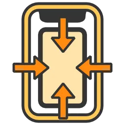

# Components Overview

You will be using these components to solve notch problems. Currently they are categorized into 2 categories.

## [UIBehaviour Components](ui-behaviour/ui-behaviour-components.md)

Works with `RectTransform` tree of the uGUI component system.

-  [SafePadding](ui-behaviour/safe-padding.md): pad the `RectTransform` in based on the value returned by [`Screen.safeArea`](https://docs.unity3d.com/ScriptReference/Screen-safeArea.html). If you anchor any child on its padded edges, then you are automatically safe.
- **(Planned)** `SafePosition` : Controls only the `anchoredPosition` of `RectTransform` such that it avoids *both* unsafe area and cutouts, by moving away *perpendicularly* from any selected edge. It would be the first component to use the `cutouts` API to dodge the exact notch rather than only the safe area.
- **(Planned)** `EdgeSplit` : In contrary to `SafePosition`'s perpendicular notch avoiding, this component tries to solve the problem by moving in *parallel* along any selected edge. It controls both `anchoredPosition` and `sizeDelta` of two `RectTransform` such that they can split or join together depending on cutout position of the device. (Imagine split on iPhone X but joined on Galaxy S10+.)

## [Adaptation Components](adaptation/adaptation-components.md)

They are based on using [Playables API](https://docs.unity3d.com/ScriptReference/Playables.Playable.html) to control `GameObject` with animation playables, therefore utilizing `Animator` and `AnimationClip` instead of `RectTransform`.

-  [AspectRatioAdaptation](adaptation/aspect-ratio-adaptation.md): Dynamically changes anything keyable by animation system, based on the ratio of the screen.
-  [SafeAdaptation](adaptation/safe-adaptation.md): Dynamically changes anything keyable by animation system, based on the safe area.

## UI Toolkit Components

Runtime [UI Toolkit](https://docs.unity3d.com/6000.3/Documentation/Manual/UIElements.html) is now available. A UI Toolkit version of these components could be developed in the future.