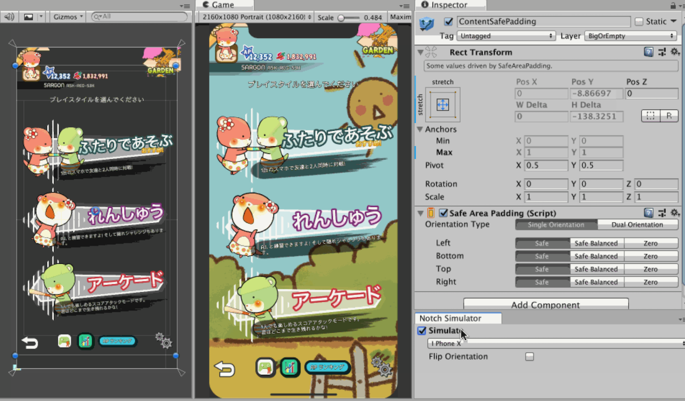
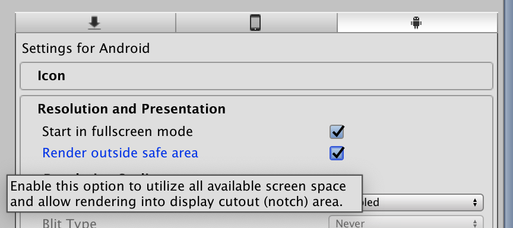

<div class="exc7-hero">
    
    <h1 class="exc7-hero-title">Notch Solution</h1>
    <p class="exc7-hero-desc">Runtime components and design tools to solve notched/cutout phones layout problems.</p>
</div>

> [!WARNING]
> Requires Unity 6.3 LTS (6000.3) or newer. The player's device must also run an OS version high enough to report `safeArea`/`cutouts`.

Whether you like it or not, the time has come for us designers to design in context of a notch and embrace it instead of hiding it. This tool also enables design-time preview which help you iterate your design without building the game.


- [Components](components/overview.md) to attach to your `GameObject`, they will stay safe by staying inside [`safeArea`](https://docs.unity3d.com/ScriptReference/Screen-safeArea.html) and out of the way of any [`cutouts`](https://docs.unity3d.com/ScriptReference/Screen-cutouts.html).
- Works with Unity's built-in [Device Simulator](simulator/device-simulator.md) so you can iterate your design in the editor across many devices. The components react immediately when you switch device, with no need to build the game or reach for a physical device.

## Easy way to pay for this software

Are you looking for a way to say thanks to this open source work other than code contribution?

It is easy! You can take a look at my myriad of niche Unity Asset Store **audio plugins** in [my publisher page](https://assetstore.unity.com/publishers/18007), grab something for your game, or tell your audio-caring friends about them. Thank you!

## Getting started

Install with the Package Manager using **Add package from git URL**:

```
https://github.com/5argon/NotchSolution.git?path=src/NotchSolution/Assets/NotchSolution
```

Or add it directly to your `Packages/manifest.json`:

```json
"com.e7.notch-solution": "https://github.com/5argon/NotchSolution.git?path=src/NotchSolution/Assets/NotchSolution"
```

To pin a version, append `#` and a release tag, e.g. `...NotchSolution.git?path=src/NotchSolution/Assets/NotchSolution#3.0.0`. Otherwise it resolves to the latest commit; remove its entry from `Packages/packages-lock.json` to refetch newer commits.

The package is also available on [the Asset Store](http://u3d.as/1FEw).

The package uses [assembly definition files](https://docs.unity3d.com/Manual/ScriptCompilationAssemblyDefinitionFiles.html). To reference it from your own assembly, the runtime assembly name is `E7.NotchSolution` (GUID : `06dd7692457a446f7a9de9613998f95d`). The C# namespace is also `E7.NotchSolution` if you want to extend the built-in components.

### 2. Use the components, iterate with the simulator

Learn the available [components](components/overview.md) and use them in your design. Open Unity's [Device Simulator](simulator/device-simulator.md) and switch devices to validate the design instantly — the components update live in the editor.

You can also see the [how-to section](how-to/index.md) for some tricks and recipes.

### 3. Set the Project Settings before you build



All the work for this moment. Enable **Render outside safe area** under **Resolution and Presentation** for Android. Otherwise you get black bars.

For iOS, I think there is no option to do black bar as Apple discourages and may denies app that tries to hide the notch, therefore it already renders outside the safe area.

### 4. License

[The license is MIT](https://github.com/5argon/NotchSolution/blob/master/LICENSE). You should do your part in the open source software movement.

## See Notch Solution in action

I have in fact dogfood my own plugin so you don't have to worry much if the support for the package dies out because of "no demand", I demand it myself. The same goes to my other products.

The game is called [Duel Otters](https://duelotters.com/) which is free. Notch Solution is especially important in this game since it is a 2-player game where the other player will have to be on the notched side. Try it with various devices and see the UI adapts!

## It's open source

At first I am going to make it a normal Asset Store package like my other works. But I realized that this is the first one that is [not](http://exceed7.com/introloop/) [so](http://exceed7.com/native-audio/) [niche](http://exceed7.com/native-touch) in its use and could have widespread benefits to many, and as an open source that effect could be multiplied greatly. I only see notched devices increasing in the recent year.

I am not sure if I could come up with an another package with this potential, so I decided to take this opportunity for the first time. There is really no strings attached if that is what you were worrying. What I get by doing this?

- Screen cutout problems can be solved collaboratively. With so many devices in the world the problem space is HUGE. I think there are many variations and potentially different permutation of problems that bound to happen later. Over time, having more inputs from users together we could make this more stable than I could ever made alone.
- I got to proof I have open source development experience added to my portfolio and [my publisher page](https://assetstore.unity.com/publishers/18007). It says something differently about me than before.
- I get exposure to my other products, where you can expect similar quality and code discipline to Notch Solution.
- It is not necessary a bad financial/business move. The author of the popular [Odin Inspector](https://odininspector.com/) has [open sourced their Odin Serializer](https://devdog.io/blog/odin-serializer-goes-open-source/) with good reasons. More often than not, it also shows that they are capable of writing quality code.
