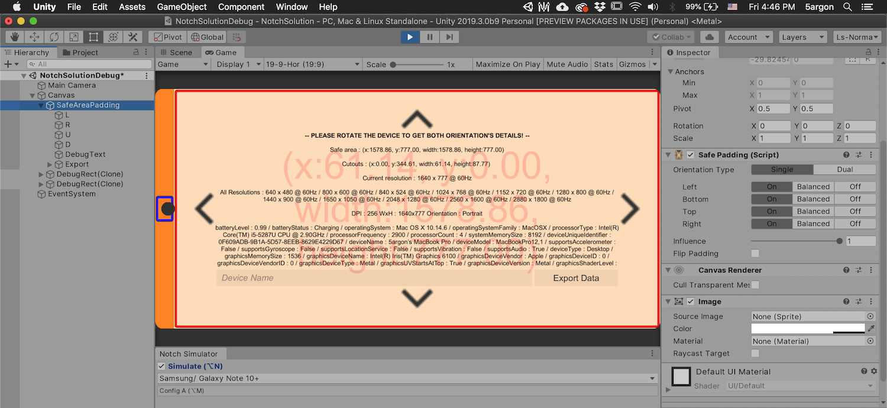

# Debug Scene

A sample scene that displays the current safe area, cutouts, and device information. It works in the editor (following the [Device Simulator](device-simulator.md)) and on a physical device.

It shows:

- The `safeArea` rectangle, padded in from the edges of the screen.
- The `cutouts` rectangles — the exact bounds around each notch or punch-hole, rather than the single overall padding that `safeArea` gives.
- A dump of [`SystemInfo`](https://docs.unity3d.com/6000.3/Documentation/ScriptReference/Device.SystemInfo.html) for the device.

All values are read through `UnityEngine.Device.Screen` / `UnityEngine.Device.SystemInfo`, so they reflect the simulated device in the editor and the real device in a build.

## Getting the sample

The scene ships as a package sample. In the Package Manager, select Notch Solution and press **Import** on the **Debug Scene** sample to copy it into your project under `Assets/Samples/…`. You can delete that folder at any time; the package itself stays linked without cluttering your `Assets`.

## Building it

Build the scene to a device to inspect that device's real safe area and cutouts. The `SystemInfo` dump uses reflection, so if you build with IL2CPP keep managed stripping low (or use Mono), otherwise some fields may be stripped and won't appear on screen.
