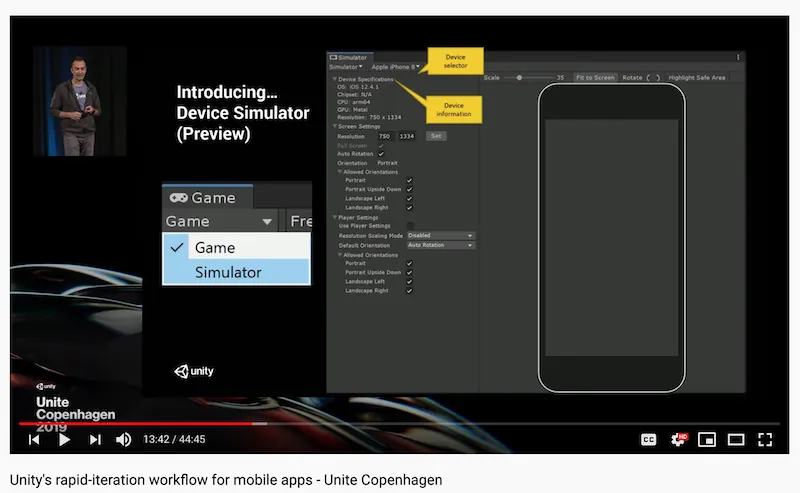

# Device Simulator

Notch Solution's [components](../components/overview.md) read the safe area and cutouts through [`UnityEngine.Device.Screen`](https://docs.unity3d.com/6000.3/Documentation/ScriptReference/Device.Screen.html). In a build this returns the real device values; in the editor it returns the values of the device selected in Unity's built-in [Device Simulator](https://docs.unity3d.com/6000.3/Documentation/Manual/device-simulator.html). The same component works in both places with no extra setup and no simulation layer of our own.

## Using it

- Open **Window > General > Device Simulator**, or pick **Simulator** from the drop-down at the top-left of the **Game** view.
- Choose a device from the device drop-down. Unity ships a set of devices covering common notch and punch-hole layouts, and shows a device overlay so you can see what the hardware obstructs.
- Notch Solution components update immediately when you switch device or rotate — no Play mode required. It also works while editing a prefab in Prefab Mode.

Nothing is added to your scene when you switch devices, so previewing never dirties the scene. Because the components follow `Screen` at runtime, what you see in the Simulator is what you get on device.

## Adding more devices

Devices come from Unity, not from Notch Solution. To simulate a device that is not in the list, add a Unity device definition — a `.device` JSON file plus an optional overlay image — as described in Unity's [Adding a device](https://docs.unity3d.com/6000.3/Documentation/Manual/device-simulator-adding-a-device.html). Each definition can declare a `safeArea` and `cutouts` per orientation, which is exactly what the components consume.

## Rendering outside the safe area

To render edge-to-edge on device (and let Notch Solution pad the safe area back in), enable **Render outside safe area** under **Project Settings > Player > Resolution and Presentation** for Android. iOS already renders outside the safe area, as Apple discourages hiding the notch with black bars.
